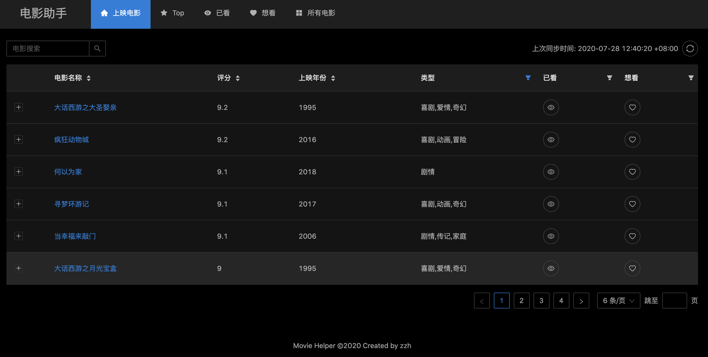
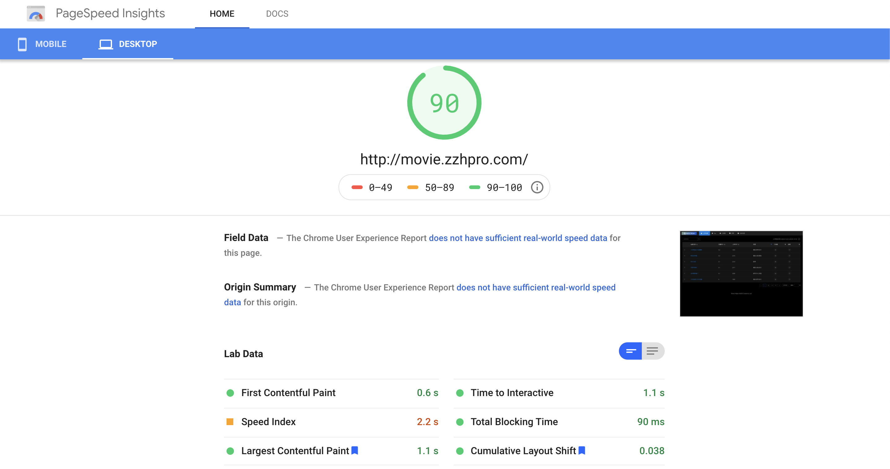

# React-SpringBoot

%20Movie%20management%20and%20find%20valuable%20movies%20to%20watch&logo=https%3A%2F%2Fgithub.com%2Fzzh1991%2FReact-SpringBoot%2Fraw%2Fmaster%2Fsrc%2Fmain%2Fresources%2Fstatic%2Ffavicon.ico&owner=1&theme=Light)

<p align="center">
    <p align="center">
      	
        <a href="https://github.com/zzh1991/React-SpringBoot/blob/master/LICENSE"></a>
        <a href="#"></a>
        <a href="https://github.com/zzh1991/React-SpringBoot/blob/master/.travis.yml"></a>
        <a href="https://snyk.io/test/github/zzh1991/React-SpringBoot?targetFile=pom.xml"></a>
    </p>
</p>


## Demo: [Movie Helper](http://movie.zzhpro.com)

### 桌面显示



最近，我花费了不少时间将性能得分从 50 多升到了 90 分。目前的体验和响应速度都有了很大的提升。



### 手机显示

<div align="center"></div>

## 访问数


## 克隆项目

后端项目地址：[React-SpringBoot](https://github.com/zzh1991/React-SpringBoot)

前端项目地址：[movie-helper-front](https://github.com/zzh1991/movie-helper-front)

```bash
git clone --recursive git@github.com:zzh1991/React-SpringBoot.git

# or
git clone git@github.com:zzh1991/React-SpringBoot.git
git submodule init
git submodule update
```

## 🚀 使用

### 启动应用

#### 配置数据库

> 在 [src/main/resources/application.yml](https://github.com/zzh1991/React-SpringBoot/blob/master/src/main/resources/application.yml) 中配置数据库用户名，密码和数据库名

你可以使用 PostgreSQL（默认配置）或者 MySQL 数据库。另外，你也可以使用 H2 数据库。

##### MySQL 配置

```yaml
spring:
  datasource:
    driver-class-name: com.mysql.cj.jdbc.Driver
    url: jdbc:mysql://localhost:3306/movie?allowPublicKeyRetrieval=true&useConfigs=maxPerformance&useSSL=false&serverTimezone=UTC&characterEncoding=utf8
    password: mysql
    username: root
    initialization-mode: never

  flyway:
    enabled: true
    baseline-on-migrate: true
    validate-on-migrate: false
    locations: classpath:db/migration/mysql
```

> 在 pom.xml 文件中删除 postgres 依赖，并添加 mysql 依赖

```xml
<!-- remove -->
<dependency>
    <groupId>org.postgresql</groupId>
    <artifactId>postgresql</artifactId>
</dependency>

<!-- add -->
<dependency>
    <groupId>mysql</groupId>
    <artifactId>mysql-connector-java</artifactId>
</dependency>
```

#### 配置前端依赖

- `cd front`：切换到前端文件夹
- `yarn`: 安装前端依赖
- 启动前端
  - 开发模式
    - `yarn start`
  - 生产部署模式
    - `yarn deploy`
- 在 IDE 中启动应用
- 打开浏览器
  - 开发模式: go to http://localhost:3000
  - 生产部署模式: 访问 http://localhost:8080

### 更新前端代码

```bash
cd front
git fetch origin master
git rebase origin/master

# or
git submodule update --remote front
```

## 生成 Java API 文档

```bash
mvn javadoc:javadoc
```

> 打开 `target/site/apidocs/index.html` 进行访问

### 参考

- [最近的电影](https://movie.douban.com/)
- [TOP 电影](https://movie.douban.com/top250?start=0&filter=)

## 代办事务

### 提升

- [x] 同步最新/TOP100 电影
- [x] 添加最近同步的时间
- [x] 根据电影名称进行搜索
- [x] 使用最新的 PostgresQL
- [x] 定时任务
- [x] Java 文档
- [x] 懒加载
- [x] 使用带时区的时间戳格式

## 依赖技术

### [前端技术](https://github.com/zzh1991/movie-helper-front)

### 后端技术

- Spring Boot 2.3
- PostgresQL 12
- Guava
- Spring fox Swagger
- Flyway 6
- Prometheus
- GraphQL
- Mybatis
- Mybatis-plus

## 应用网址

### Swagger UI

- http://localhost:8080/swagger-ui.html

### 监控网址

- http://localhost:8080/actuator
- http://localhost:8080/actuator/prometheus

### GraphiQL 网址

- http://localhost:8080/graphiql

## 配置

### Intellij IDEA 热部署

```xml
<dependency>
    <groupId>org.springframework.boot</groupId>
    <artifactId>spring-boot-devtools</artifactId>
    <optional>true</optional>
</dependency>
```

- setting -> compiler -> make project automatically
- ctrl + shift + a -> registry -> auto make enabled

### 使用 dev 配置文件启动项目

1. 修改启动项 run/debug 配置
2. 增加环境变量: `spring.profiles.active=dev`

### 依赖版本管理

```xml
<plugin>
    <groupId>org.codehaus.mojo</groupId>
    <artifactId>versions-maven-plugin</artifactId>
</plugin>
```

#### 显示依赖的版本更新

```bash
mvn versions:display-dependency-updates
```

#### 升级依赖版本

```bash
mvn versions:use-next-releases

mvn versions:use-latest-releases
```

## 问题

### 从 flyway 3.x 迁移到 5.x 出错

> 首先将版本升到 **4.2.0** 然后再升到 5.x

### H2 数据库与 `druid` 有冲突?

### Mybatis `timestamptz` 不能转化成 `timestamp` 类型?

> 参考 https://github.com/mybatis/mybatis-3/issues/1644

1. 复制 `LocalDateTimeTypeHandler.java` 到项目中
2. 配置 `LocalDateTimeTypeHandler` bean

## 作者

👤 **Zhihao Zhang**

- Github: [@zzh1991](https://github.com/zzh1991)

## 点赞👍支持

如果本项目对你有所帮助，请 ⭐️ 本项目吧!

## 📝 许可证

Copyright © 2021 [zzh1991](https://github.com/zzh1991).<br />
本项目许可证为 [MIT](https://github.com/zzh1991/React-SpringBoot/blob/master/LICENSE).
