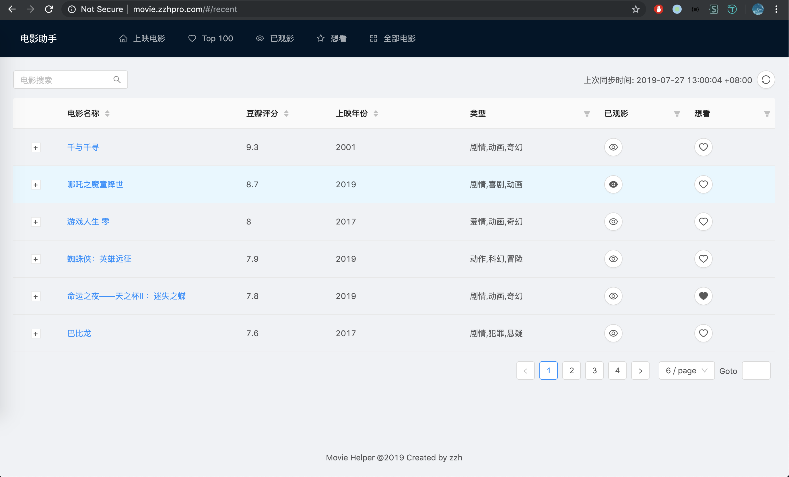
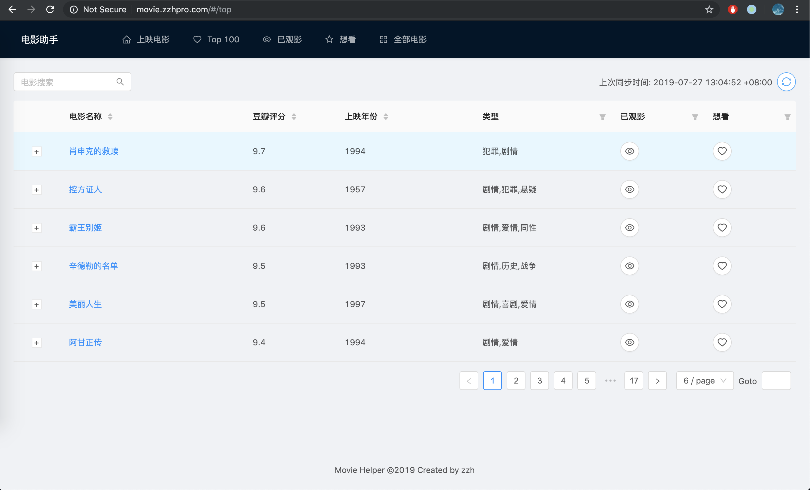
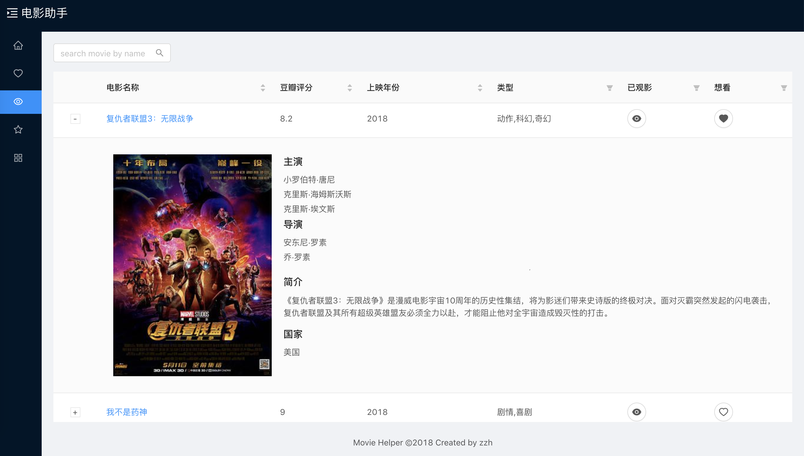
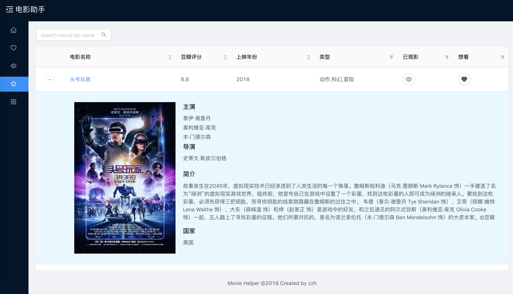
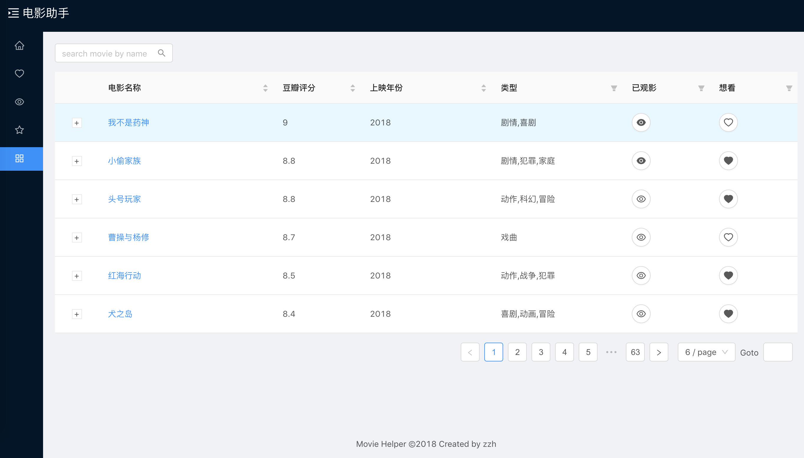

# React-SpringBoot

<p align="center">
    <a href="http://movie.zzhpro.com">
        
    </a>
    <h3 align="center">Movie Helper</h3>
    <p align="center">
        <a href="https://github.com/zzh1991/React-SpringBoot/blob/master/LICENSE"></a>
        <a href="#"></a>
        <a href="#"></a>
        <a href="#"></a>
        <a href="https://github.com/zzh1991/React-SpringBoot/blob/master/.travis.yml"></a>
        <a href="https://snyk.io/test/github/zzh1991/React-SpringBoot?targetFile=pom.xml"></a>
    </p>
    <p align="center">
        Movie management and find valuable movies to watch<br>
    </p>
</p>

## Git clone repo

```bash
git clone --recursive git@github.com:zzh1991/Movie-Helper.git

# or
git clone git@github.com:zzh1991/Movie-Helper.git
git submodule init
git submodule update
```

## 🚀 Usage

### Start application

- configure database
    - configure your database name (an empty database), user, password in [src/main/resources/application.yml](https://github.com/zzh1991/React-SpringBoot/blob/master/src/main/resources/application.yml)
    - or use h2 database
- `cd front`
- `yarn`: install dependency
- prepare front static files
  - dev mode
    - `yarn start`
  - build mode
    - `yarn run deploy`
- start the web app in IDE
- open browser
  - `build mode`: go to http://localhost:8080
  - `dev mode`: go to http://localhost:3000

### Update submodule for front end

```bash
cd front
git fetch origin master
git rebase origin/master

# or
git submodule update --remote front
```

## Java doc

```bash
mvn javadoc:javadoc
```

> open `target/site/apidocs/index.html` by browser

## Demo: [Movie Helper](http://movie.zzhpro.com)

### Recent Movies



### Top 100 Movies



### Viewed Movies



### Stared Movies(Want to watch)



### All Movies



### Reference

- [recent movies](https://movie.douban.com/)
- [top movies](https://movie.douban.com/top250?start=0&filter=)

## Todo

### Improvement

- [x] sync recent / top movies
- [x] latest sync time
- [x] search movie name
- [x] database upgrade
- [x] schedule task
- [x] java doc
- [x] lazy load
- [x] use timestamp with time zone

## Dependency

### [Front end](https://github.com/zzh1991/movie-helper-front)

### Backend

- Spring Boot 2
- PostgresQL
- Guava
- Swagger2
- Flyway
- Prometheus
- GraphQL
- Mybatis

## Config

### Hot deploy for Intellij IDEA

```xml
<dependency>
    <groupId>org.springframework.boot</groupId>
    <artifactId>spring-boot-devtools</artifactId>
    <optional>true</optional>
</dependency>
```

- setting -> compiler -> make project automatically
- ctrl + shift + a -> registry -> auto make enabled

### Active dev profile

1. edit run/debug configuration
2. add environment variables: spring.profiles.active=dev

### Dependency Version Management

```xml
<plugin>
    <groupId>org.codehaus.mojo</groupId>
    <artifactId>versions-maven-plugin</artifactId>
    <version>2.7</version>
</plugin>
```

#### Display update

```bash
mvn versions:display-dependency-updates
```

#### Update dependency

```bash
mvn versions:use-next-releases

mvn versions:use-latest-releases
```

## Problems

### Migrate flyway 3.x to 5.x issue

> firstly should migrate to **4.2.0** and then 5.x

### H2 database conflict with `druid`?

### Mybatis `timestamptz` could not convert to `timestamp`?

## Author

👤 **Zhihao Zhang**

- Github: [@zzh1991](https://github.com/zzh1991)

## Show your support

Please ⭐️ this repository if this project helped you!

## 📝 License

Copyright © 2020 [zzh1991](https://github.com/zzh1991).<br />
This project is [MIT](https://github.com/zzh1991/React-SpringBoot/blob/master/LICENSE) licensed.
