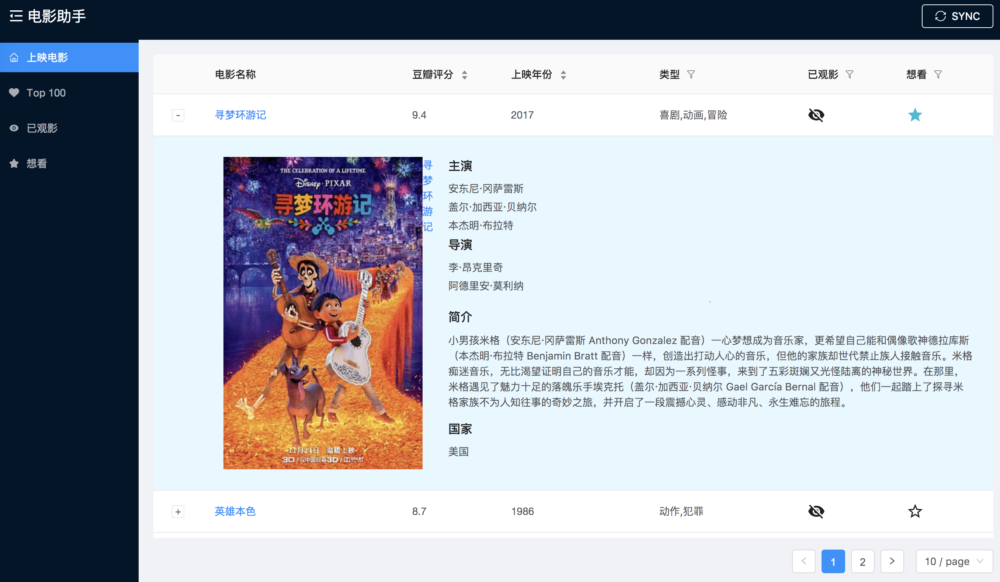
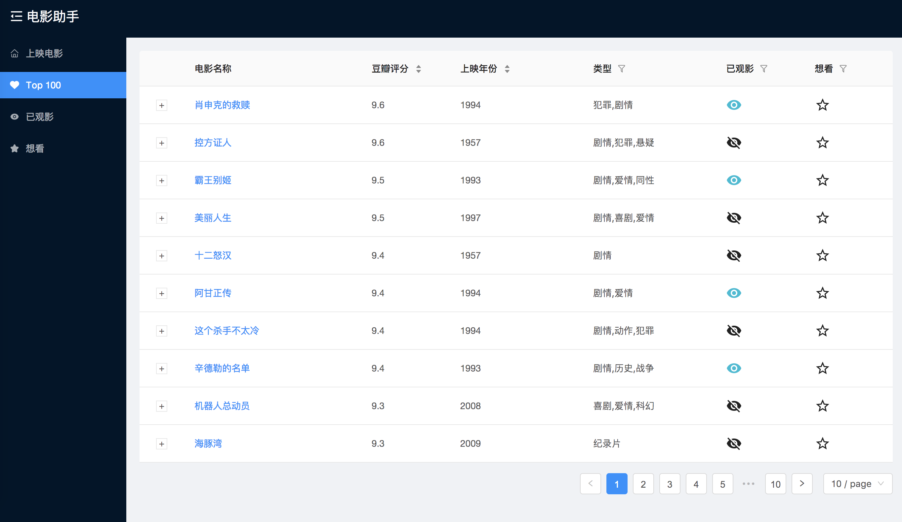

# React-SpringBoot

<p align="center">
    <a href="http://movie.zzhpro.com">
        
    </a>
    <h3 align="center">Movie Helper</h3>
    <p align="center">
        <a href="https://github.com/zzh1991/React-SpringBoot/blob/master/LICENSE"></a>
        <a href="#"></a>
        <a href="#"></a>
        <a href="#"></a>
        <a href="https://github.com/zzh1991/React-SpringBoot/blob/master/.travis.yml"></a>
    </p>
    <p align="center">
        Movie management and find valueable movies to watch<br>
    </p>
</p>

## Install
- npm install
- npm run build
- configure you database name (an empty database) in application.properties
- start the web app in IDE
- open browser: http://localhost:8080

## Demo: [Movie Helper](https://movieshelper.herokuapp.com/)
### Recent Movies

### Top 100 Movies

### Viewed Movies

### Movies wanted to watch

### Ref
- [recent](https://movie.douban.com/)
- [top](https://movie.douban.com/top250?start=0&filter=)

## TO DO LIST
### login page
    - [x] sign in / sign up
    - [x] less render
    - update time
### data bind with user id

### improvement
    - [x] sync recent movies
    - [x] antd 3.0.0

## Dependency
### front-end
- react
- react-router
- react-redux
- redux-thunk
- redux-saga
- material-ui (only few components will be used)
- ant design
- webpack
- babel dependency

### backend
- Spring Boot
- PostgreSQL
- Guava
- Swagger2
- flyway

## Config
### hot deploy for Intellij IDEA
```xml
<dependency>
    <groupId>org.springframework.boot</groupId>
    <artifactId>spring-boot-devtools</artifactId>
    <optional>true</optional>
</dependency>
```
- setting -> compiler -> make project automatically
- ctrl + shift + a -> registry -> auto make enabled

## react router v4
### HashRouter
- install react-router-dom
```javascript
<HashHashRouter>
  <div>
    <Route exact path="/" component={App} />
    <Route path="/app" component={App} />
  </div>
</HashRouter>

// this.context.router.history.push('path');
```

## webpack
### babel
- arrow function: transform-class-properties
- async: "transform-runtime", { "polyfill": false, "regenerator": true }

### webpack-dev-server

## [Parcel](https://parceljs.org/)
### Problems
- css packaged, class name is not same, so not css effect
- svg, jpg url path is not right for static resource, not web resource
