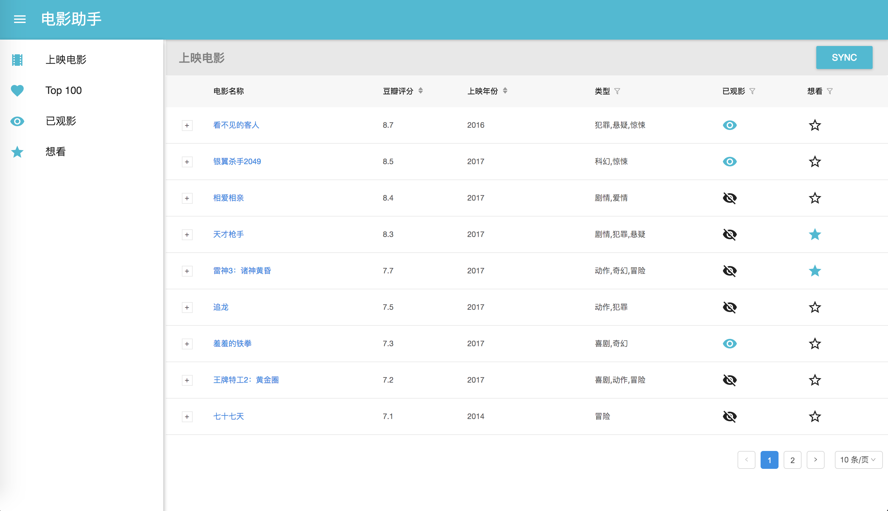
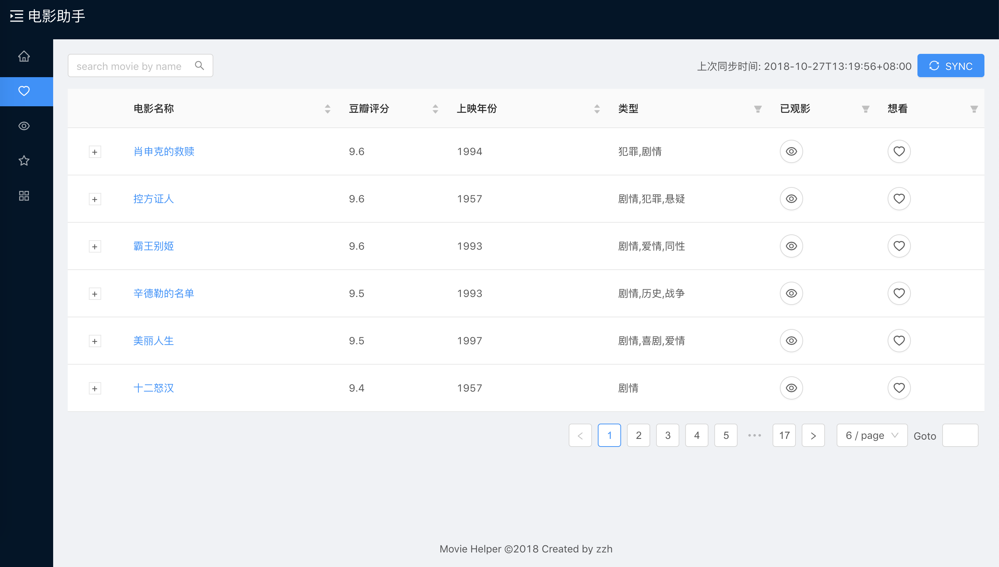

# React-SpringBoot

## Install
- npm install
- webpack
- configure you database name (an empty database)
- start the web app in IDE
- open browser: http://localhost:8080

## Demo: Movie Helper
### Recent Movies

### Top 100 Movies

### Viewed Movies

### Movies to watch

## TO DO LIST
### login page
    - sign in / sign up
### data bind with user id

## Dependency
### front-end
- react
- react-router
- react-redux
- redux-thunk
- redux-saga
- material-ui
- ant design
- webpack
- babel dependency

### backend
- Spring Boot
- PostgreSQL
- Guava
- Swagger2
- flyway

## Config
### hot deploy for Intellij IDEA
```xml
<dependency>
    <groupId>org.springframework.boot</groupId>
    <artifactId>spring-boot-devtools</artifactId>
    <optional>true</optional>
</dependency>
```
- setting -> compiler -> make project automatically
- ctrl + shift + a -> registry -> auto make enabled

## react router v4
### HashRouter
- install react-router-dom
```javascript
<HashHashRouter>
  <div>
    <Route exact path="/" component={App} />
    <Route path="/app" component={App} />
  </div>
</HashRouter>

// this.context.router.history.push('path');
```

## webpack
### babel
- arrow function: transform-class-properties
- async: "transform-runtime", { "polyfill": false, "regenerator": true }

### webpack-dev-server